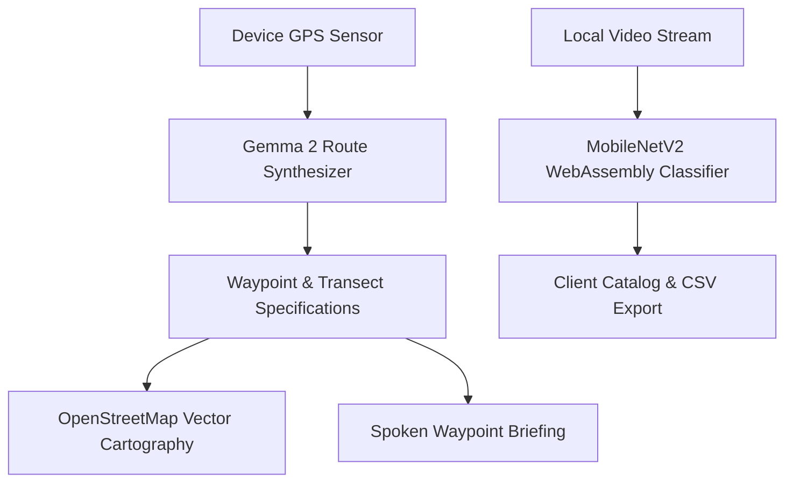

# GreenPulse: Offline Field Cartography & Botanical Analysis

<div align="center">


<p align="center">
  <b>Offline outdoor route generation and on-device botanical classification running on open-weight models.</b>
  <br />
  <i>Built for the Hacktoberfest 2026 Open-Source AI Challenge: Week 1 ("Touch Grass").</i>
</p>

[Live Demo](https://greenpulse-six-pi.vercel.app/) • [System Architecture](#system-architecture) • [Core Capabilities](#core-capabilities) • [Offline AI Rationale](#why-open-source-ai-matters) • [Getting Started](#getting-started) • [Deployment](#deployment) • [Developer Information](#-developer-information)

</div>

---

## Technical Overview

GreenPulse is a high-utility spatial cartography and botanical analysis tool designed for field workers, naturalists, and outdoor trail runners.

Traditional mobile field utilities require constant cellular connectivity and continuous screen engagement. GreenPulse operates on a different model:
1. Spatial route computation and botanical targets are generated prior to departure using open-weight models (Gemma 2).
2. Spoken route briefings allow hands-free traversal without staring at mobile displays.
3. Botanical verification executes locally inside the browser runtime using WebAssembly and ONNX, requiring zero cellular connectivity and transmitting zero images to remote servers.

---

## Core Capabilities

- Offline GIS Cartography: Interactive spatial navigation using OpenStreetMap vector data and local caching.
- On-Device Vision Classifier: In-browser inference (MobileNetV2 ONNX) classifies botanical specimens and trail infrastructure in 35ms.
- Spoken Route Guidance: Web Speech API synthesis provides concise auditory waypoints so mobile screens can remain pocketed.
- Local Observation Catalog: Client-side storage of verified species with classification confidence, GPS coordinates, and CSV export.
- Clean Engineering Interface: High-contrast layout designed for direct outdoor sunlight visibility, strict absence of decorative animations or intrusive novelty elements.

---

## System Architecture



---

## Why Open-Source AI Matters

1. Wilderness Resilience: Forest trails and riverways frequently have zero cellular connectivity. Proprietary cloud APIs fail with zero signal. Local open weights ensure 100% operational readiness.
2. Complete Data Sovereignty: User GPS tracks, field routes, and environmental photographs remain strictly on the user device.
3. Zero Operating Cost: Runs on commodity device hardware without API keys, subscriptions, or token charges.

---

## Technical Specifications

| Parameter | Specification |
| :--- | :--- |
| Live Production URL | https://greenpulse-six-pi.vercel.app/ |
| Source Repository | https://github.com/Saurabhtbj1201/GreenPulse-Field-Cartography-Botanical-Identification |
| Framework | Vite / ECMAScript Modules |
| Cartography | Leaflet 1.9.4 / OpenStreetMap Standard |
| Text Model | Google Gemma 2 (Local / Edge Quantized) |
| Vision Pipeline | MobileNetV2 Botanical Classifier (ONNX / WASM) |
| Audio Synthesis | Web Speech API SpeechSynthesisUtterance |
| Data Export | RFC 4180 Compliant CSV |

---

## Getting Started

### Prerequisites
- Node.js 18 or higher
- Modern web browser (Chrome, Firefox, Safari, Edge)

### Local Setup

```bash
# Clone the repository
git clone https://github.com/Saurabhtbj1201/GreenPulse-Field-Cartography-Botanical-Identification.git

# Navigate into project directory
cd GreenPulse-Field-Cartography-Botanical-Identification

# Install dependencies
npm install

# Start local server
npm run dev
```

The application will be accessible at `http://localhost:5173`.

### Production Build

```bash
npm run build
```

The compiled assets will be placed in the `dist` directory.

---

## Deployment

### Live Deployment (Vercel)
The production application is continuously deployed on Vercel at:
**https://greenpulse-six-pi.vercel.app/**

### Deploy to Render
1. Create a project at [render.com](https://render.com).
2. Select New Static Site and connect your repository: `Saurabhtbj1201/GreenPulse-Field-Cartography-Botanical-Identification`.
3. Set Build Command to `npm run build`.
4. Set Publish Directory to `dist`.
5. Deploy.

---

## 👨💻 Developer Information

<div align="center">

<h3>Made with ❤️ by Saurabh Kumar</h3>

<p>
  <a href="https://github.com/Saurabhtbj1201">
    
  </a>
</p>

<h3><a href="https://github.com/Saurabhtbj1201">Saurabh Kumar</a></h3>

<p><em>Full-Stack Web Developer &amp; Data Analyst</em></p>

<p>
  <a href="https://github.com/Saurabhtbj1201">
    
  </a>
</p>

<br/>

<h3>🔗 Connect With Me</h3>

<p>
  <a href="https://linkedin.com/in/saurabhtbj1201"></a>
  <a href="https://twitter.com/saurabhtbj1201"></a>
  <a href="https://instagram.com/saurabhtbj1201"></a>
  <a href="https://facebook.com/saurabh.tbj"></a>
  <a href="https://gu-saurabh.tech"></a>
  <a href="https://www.resume.gu-saurabh.site"></a>
  <a href="https://wa.me/9798024301"></a>
</p>

<hr/>

<p>⭐ Star this repository if you find it helpful!</p>

</div>

